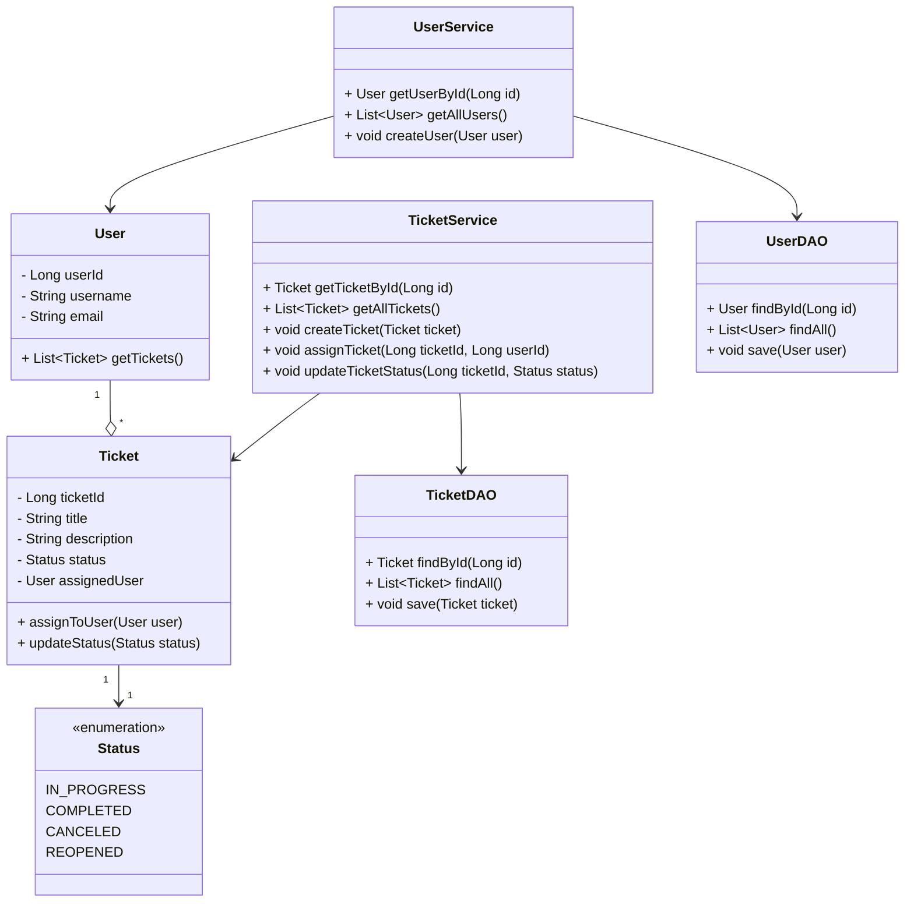

```mermaid
classDiagram

    class User {
        - Long userId
        - String username
        - String email
        + List~Ticket~ getTickets()
    }

    class Ticket {
        - Long ticketId
        - String title
        - String description
        - Status status
        - User assignedUser
        + assignToUser(User user)
        + updateStatus(Status status)
    }

    class Status {
        <<enumeration>>
        IN_PROGRESS
        COMPLETED
        CANCELED
        REOPENED
    }

    class UserService {
        + User getUserById(Long id)
        + List~User~ getAllUsers()
        + void createUser(User user)
    }

    class TicketService {
        + Ticket getTicketById(Long id)
        + List~Ticket~ getAllTickets()
        + void createTicket(Ticket ticket)
        + void assignTicket(Long ticketId, Long userId)
        + void updateTicketStatus(Long ticketId, Status status)
    }

    class UserDAO {
        + User findById(Long id)
        + List~User~ findAll()
        + void save(User user)
    }

    class TicketDAO {
        + Ticket findById(Long id)
        + List~Ticket~ findAll()
        + void save(Ticket ticket)
    }

    User "1" --o "*" Ticket
    Ticket "1" --> "1" Status
    UserService --> User
    UserService --> UserDAO
    TicketService --> Ticket
    TicketService --> TicketDAO
  

```