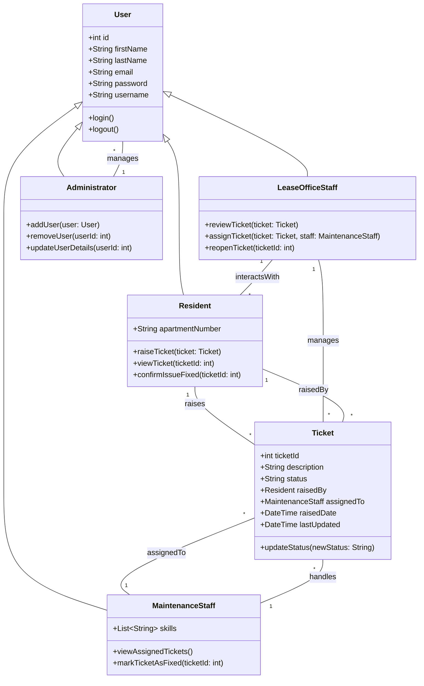

```mermaid
classDiagram
    class User {
        +int id
        +String firstName
        +String lastName
        +String email
        +String password
        +String username
        +login()
        +logout()
    }
 
    class Resident {
        +String apartmentNumber
        +raiseTicket(ticket: Ticket)
        +viewTicket(ticketId: int)
        +confirmIssueFixed(ticketId: int)
    }
    User <|-- Resident
 
    class LeaseOfficeStaff {
        +reviewTicket(ticket: Ticket)
        +assignTicket(ticket: Ticket, staff: MaintenanceStaff)
        +reopenTicket(ticketId: int)
    }
    User <|-- LeaseOfficeStaff
 
    class MaintenanceStaff {
        +List~String~ skills
        +viewAssignedTickets()
        +markTicketAsFixed(ticketId: int)
    }
    User <|-- MaintenanceStaff
 
    class Administrator {
        +addUser(user: User)
        +removeUser(userId: int)
        +updateUserDetails(userId: int)
    }
    User <|-- Administrator
 
    class Ticket {
        +int ticketId
        +String description
        +String status
        +Resident raisedBy
        +MaintenanceStaff assignedTo
        +DateTime raisedDate
        +DateTime lastUpdated
        +updateStatus(newStatus: String)
    }
 
    Resident "1" -- "*" Ticket : raises
    LeaseOfficeStaff "1" -- "*" Ticket : manages
    MaintenanceStaff "1" -- "*" Ticket : handles
    Ticket "*" -- "1" Resident : raisedBy
    Ticket "*" -- "1" MaintenanceStaff : assignedTo
    LeaseOfficeStaff "1" -- "*" Resident : interactsWith
    Administrator "1" -- "*" User : manages
```
