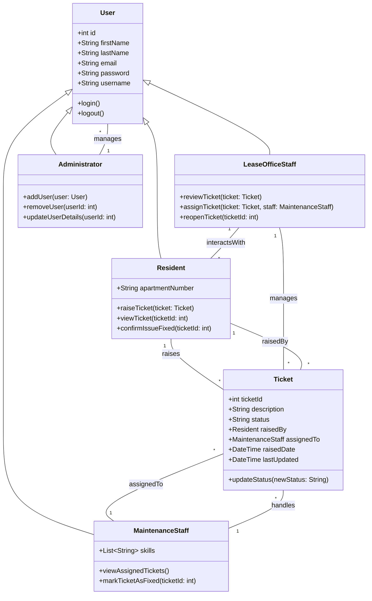
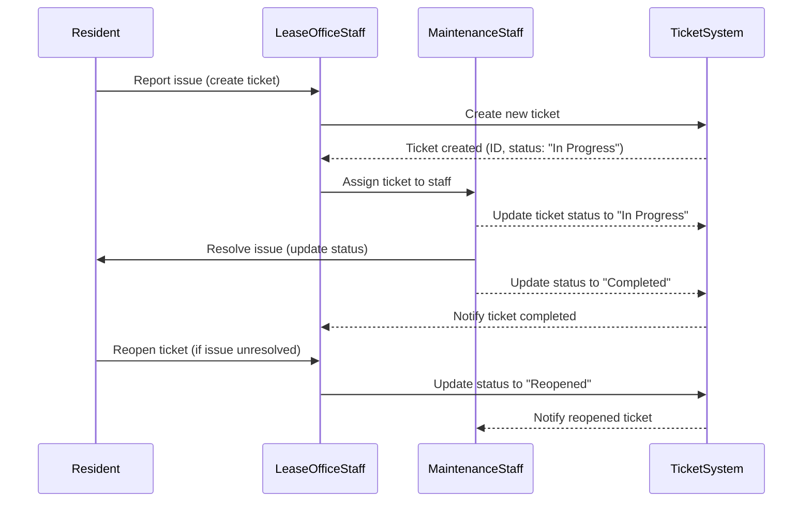

# Kinross Apartments Ticketing System

## **Project Description**  

The Kinross Apartments requires an efficient ticketing management system to streamline the maintenance of the apartments.  
Currently, the process is done manually. Whenever a resident reports an issue, the lease office staff record the problem details in an Excel sheet and assign the tasks manually to a maintenance team member.  
This process makes it difficult for the lease office staff to keep track of the status of reported issues, and sometimes the issues remain unresolved for several days.  

The ticketing system should be user-friendly and efficient.  

- Lease office staff should be able to provide access to residents, and residents should be able to raise tickets.  
- Tickets must be assigned to the appropriate maintenance staff member.  
- Maintenance staff should be able to see the problem details, resolve the issue, and update the ticket status.  
- If the resident is not satisfied with the solution, lease office staff should be able to reopen the ticket.  

---

## **Diagrams**

### **1. Project Context Diagram**

The Project Context Diagram provides a high-level overview of the interaction between users and the system.

---

### **2. Use Case Diagram**

The Use Case Diagram highlights the system's primary actors and their interactions with various use cases.

---

### **3. User Story Map**

The User Story Map organise user stories into structured layout.

---

### **4. Class Diagram**

The Class Diagram highlights the different entities and their relationship.

---

### **5. Sequence Diagram**

---

## **User Stories**  

1. As a resident, I want to raise maintenance tickets so that issues in my apartment can be resolved efficiently.  
2. As lease office staff, I want to assign tickets to maintenance staff so that reported issues are addressed promptly.  
3. As maintenance staff, I want to update ticket statuses so that all stakeholders are informed about the resolution progress.  

---

## **Acceptance Criteria**

### **User Story 1: Raise a Ticket**  

- A resident can create a ticket with mandatory fields like issue description and apartment number.  
- The system prevents the submission of tickets with missing mandatory fields.  
- The system sends a confirmation notification to the resident after ticket submission.  
- Duplicate tickets for the same issue cannot be created within a set timeframe.  

### **User Story 2: Assign a Ticket**  

- Lease office staff can view all open tickets in a list.  
- Tickets can be assigned only to active and available maintenance staff members.  
- The system sends notifications to both the staff and the assigned maintenance personnel upon assignment.  
- The ticket status updates to "Assigned" after successful assignment.  

### **User Story 3: Update Ticket Status**  

- Maintenance staff can access and view tickets assigned to them.  
- Ticket statuses can be updated to "In Progress" or "Resolved" with relevant notes.  
- The system requires maintenance staff to add resolution notes when closing a ticket.  
- Notifications are sent to the lease office staff and the resident upon ticket resolution.  

---

## **Scenarios**

### **Scenario 1: Raise a Ticket**  

- The resident logs into the system.  
- The system displays a form to raise a ticket.  
- The resident fills in issue details (e.g., description, apartment number) and submits.  
- The system validates the input:  
  - If valid, the ticket is created, and the resident is notified.  
  - If invalid, the system displays an error message and prompts for corrections.  
- The ticket appears on the lease office staff’s dashboard marked as "New."  

---

### **Scenario 2: Assign a Ticket**  

- The lease office staff logs into the system.  
- The system displays a list of open tickets.  
- The staff selects a ticket from the list.  
- The system displays available maintenance staff.  
- The staff assigns the ticket to a chosen maintenance staff member.  
- The system updates the ticket status to "Assigned" and sends notifications:  
  - To the lease office staff for confirmation.  
  - To the assigned maintenance staff with ticket details.  

---

### **Scenario 3: Update Ticket Status**  

- The maintenance staff logs into the system.  
- The system shows a list of assigned tickets.  
- The staff selects a ticket to update.  
- The system displays ticket details.  
- The staff updates the ticket status:  
  - To "In Progress" when starting the resolution.  
  - To "Resolved" when the issue is fixed, with resolution notes added.  
- The system sends notifications to the lease office staff and the resident about the status update.  
