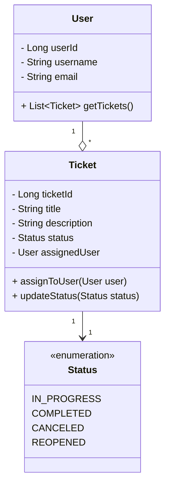

```mermaid
classDiagram
    class User {
        - Long userId
        - String username
        - String email
        + List~Ticket~ getTickets()
    }

    class Ticket {
        - Long ticketId
        - String title
        - String description
        - Status status
        - User assignedUser
        + assignToUser(User user)
        + updateStatus(Status status)
    }

    class Status {
        <<enumeration>>
        IN_PROGRESS
        COMPLETED
        CANCELED
        REOPENED
    }

    User "1" --o "*" Ticket
    Ticket "1" --> "1" Status
```