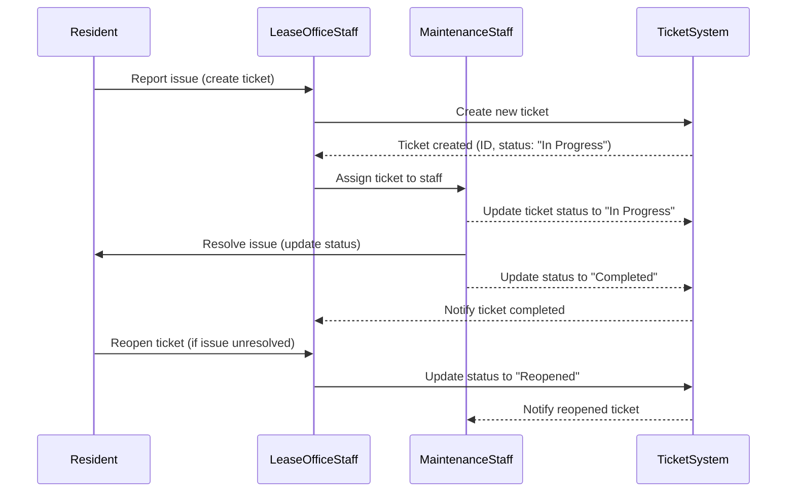

```mermaid
sequenceDiagram
    participant Resident
    participant LeaseOfficeStaff
    participant MaintenanceStaff

    Resident->>LeaseOfficeStaff: Report issue (create ticket)
    LeaseOfficeStaff->>TicketSystem: Create new ticket
    TicketSystem-->>LeaseOfficeStaff: Ticket created (ID, status: "In Progress")
    LeaseOfficeStaff->>MaintenanceStaff: Assign ticket to staff
    MaintenanceStaff-->>TicketSystem: Update ticket status to "In Progress"

    MaintenanceStaff->>Resident: Resolve issue (update status)
    MaintenanceStaff-->>TicketSystem: Update status to "Completed"
    TicketSystem-->>LeaseOfficeStaff: Notify ticket completed

    Resident->>LeaseOfficeStaff: Reopen ticket (if issue unresolved)
    LeaseOfficeStaff->>TicketSystem: Update status to "Reopened"
    TicketSystem-->>MaintenanceStaff: Notify reopened ticket
```
